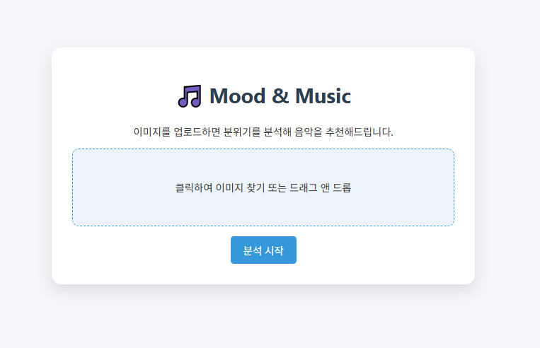
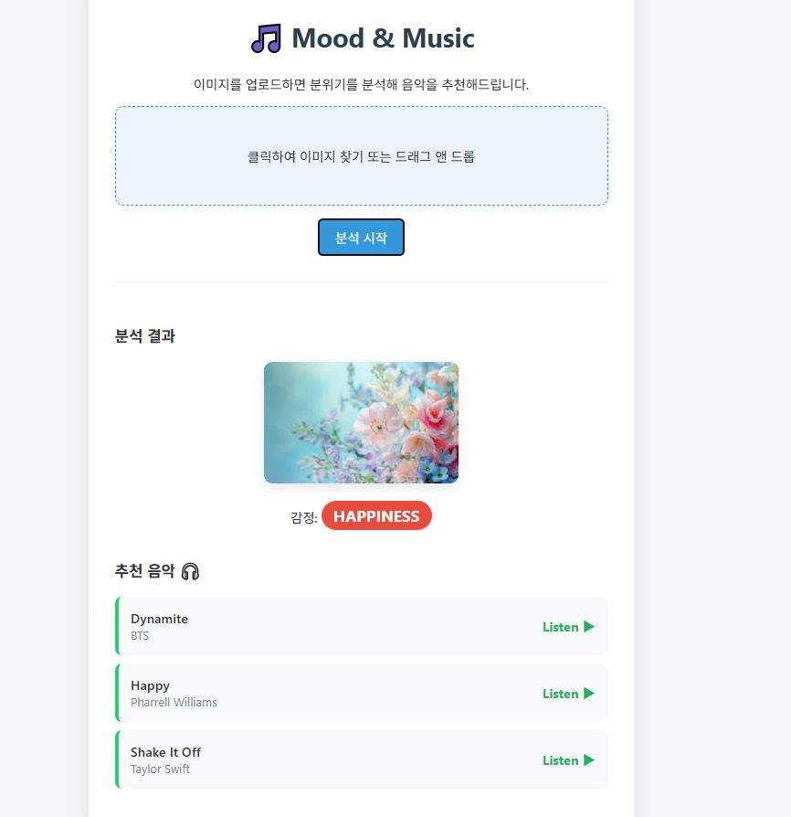

# 🎵 Mood Music Recommender (감정 기반 음악 추천 서비스)

**이미지의 감정을 분석하여, 그 분위기에 딱 맞는 음악을 추천해드립니다.**

Mood Music Recommender는 사용자가 업로드한 이미지를 분석하여 느껴지는 감정(행복, 슬픔, 분노 등)을 파악하고, 그 감정과 어울리는 음악을 AI가 자동으로 선곡해주는 웹 애플리케이션입니다.

---

## ✨ 주요 기능 (Key Features)

1.  **이미지 감정 분석 (Image Mood Analysis)**
    -   업로드된 이미지를 `CLIP` 모델과 `DistilBERT`를 활용하여 캡셔닝하고 감정을 분류합니다.
    -   분석 가능한 감정: `Happiness` (행복), `Sadness` (슬픔), `Anger` (분노), `Neutral` (중립), `Surprise` (놀람) 등

2.  **맞춤형 음악 추천 (Personalized Music Recommendation)**
    -   Spotify Audio Features를 기반으로 학습된 AI 모델이 300여 곡 이상의 데이터베이스에서 감정에 최적화된 곡을 추천합니다.
    -   단순한 키워드 매칭이 아닌, 곡의 템포, 에너지, 분위기(Valence) 등을 분석한 결과를 반영합니다.

3.  **데모 및 리얼 모드 지원**
    -   **Real Mode**: 실제 AI 모델을 구동하여 정밀한 분석 수행
    -   **Demo Mode**: 저사양 환경이나 빠른 테스트를 위한 가상 분석 모드

---

## 📸 실행 화면 (Demo Screenshots)

| 메인 화면 (Main Interface) | 결과 화면 (Analysis Result) |
|:---:|:---:|
|  |  |
| *이미지 업로드 및 분석 요청* | *분석된 감정과 추천 음악 리스트* |

---

## 🛠 시스템 구조 (Architecture)

### 1. Mood Analyzer (이미지 분석기)
-   **위치**: `modules/mood_analyzer.py` / `image_classification/`
-   **동작 원리**:
    -   **Step 1**: `CLIP Interrogator` (ViT-L-14)가 이미지를 보고 텍스트 설명(Caption)을 생성합니다.
    -   **Step 2**: Fine-tuning된 `DistilBERT` 모델이 텍스트의 감정을 분류합니다.

### 2. Music Recommender (음악 추천기)
-   **위치**: `modules/music_recommender.py` / `music_classification/`
-   **동작 원리**:
    -   Spotify API로 수집된 수백 곡의 Audio Feature(`energy`, `valence`, `tempo` 등)를 로드합니다.
    -   학습된 `MLP(Multi-Layer Perceptron)` 모델이 각 노래의 감정을 미리 분류하여 DB를 구축합니다.
    -   사용자의 감정이 입력되면 해당 감정 카테고리의 노래 중 5곡을 랜덤 추천합니다.

---

## 🚀 시작하기 (Getting Started)

### 사전 준비 (Prerequisites)
-   Python 3.8 이상
-   (선택) CUDA 지원 GPU (Real Mode 실행 시 권장)

### 설치 (Installation)
1. **저장소 클론**
   ```bash
   git clone [repository_url]
   cd gg-project-main
   ```

2. **의존성 설치**
   ```bash
   pip install -r requirements.txt
   
   # Real Mode(이미지 정밀 분석) 사용 시 추가 설치 필요
   pip install clip-interrogator accelerate
   ```

### 실행 (Running the App)
```bash
python app.py
```
- 브라우저를 열고 `http://localhost:5000` 접속

---

## 📁 프로젝트 구조 (Directory Structure)

```
gg-project-main/
├── app.py                  # Flask 웹 애플리케이션 메인 파일
├── requirements.txt        # 프로젝트 의존성 목록
├── assets/                 # 스크린샷 및 정적 자원
├── modules/                # 핵심 로직 모듈
│   ├── mood_analyzer.py    # 이미지 감정 분석 클래스
│   └── music_recommender.py # 음악 추천 클래스
├── templates/              # 웹 페이지 템플릿 (HTML)
├── static/                 # CSS 및 업로드 파일 저장소
├── training/               # 모델 학습용 스크립트
├── image_classification/   # [AI] 이미지 모델 및 노트북
│   ├── model.pth           # 텍스트 감정 분류 모델
│   └── ...
└── music_classification/   # [AI] 음악 모델 및 데이터
    ├── audio_emotion_classifier_scale.pth # 음악 감정 분류 모델
    ├── audio_feature_scale.json           # 음악 데이터셋
    └── README.md
```

---

## ⚠️ 참고 사항
- **Policy**: 시스템을 파괴하거나 유해한 코드는 포함되어 있지 않으며, `policy.json`에 따라 안전하게 관리됩니다.
- **Mode Switching**: `app.py` 내부의 `DEMO_MODE` 플래그 또는 초기화 시 의존성 확인을 통해 자동으로 모드가 전환됩니다.
